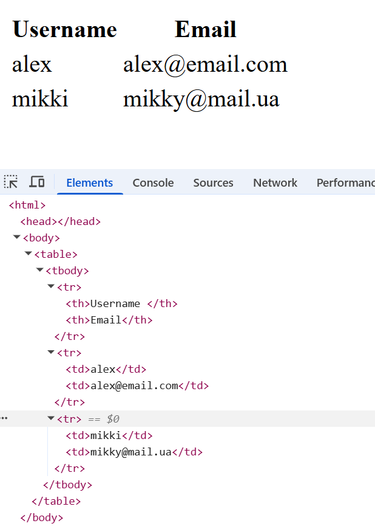

## Task 01
Створіть структуру проекта:

```
Task 01
Створіть структуру проекта:
📦homework_05
 ┣ 📂config
 ┃ ┗ 📜dev.json
 ┣ 📂utilities
 ┃ ┣ 📜get_csv.js
 ┃ ┗ 📜write.js
 ┣ 📂views
 ┃ ┣ 📜data.pug
 ┃ ┣ 📜form.pug
 ┃ ┗ 📜main.pug
 ┣ 📜app.js
 ┣ 📜data.csv
 ┣ 📜package-lock.json
 ┗ 📜package.json
```

📌 Файл data.csv візьміть із архіву to_homework_05.zip.

## Task 02
Інсталюйте необхідні бібліотеки та фреймворки:

- config

- cross-env

- csv-parse

- csv-writer

- express

- pug

Додайте **nodemon** як **devDependencies**.

## Task 03
У файлі package.json додайте скрипт:

``` "start": "cross-env NODE_ENV=dev nodemon app.js"```


## Task 04
У файлі `app.js` створіть застосунок Express. Імпортуйте пакети:

- config

- fs

- path

Налаштуйте прийом POST-даних:
```
// POST data
app.use(express.json());
app.use(express.urlencoded({ extended: true })); // form-urlencoded
```
Додайте запуск сервера через `app.listen(...)`.

## Task 05

Налаштуйте роботу з Pug і встановіть шлях до теки з шаблонами:
```
// Template setup
app.set('view engine', 'pug');

// Setup views folder
app.set('views', './views');
```

## Task 06
Створіть роутинг для URL `/`, який завантажує файл `views/main.pug`.

У файлі `main.pug` створіть список ul посилань:
```
a(href="/") Main  
a(href="/form") Form  
a(href="/data") Data
```
Перевірте, як працює створений код.

## Task 07
Підключіть модуль `getCSV` з теки `utilities`.

Створіть роутинг для URL /data, який виконує:
```
const records = await getCSV('data.csv', {});
```
Передайте records до шаблону views/data.pug.

Конфігурацію {} задайте самостійно.

## Task 08
У файлі `views/data.pug` створіть таблицю з заголовками:

```
<tr><th>Username</th><th>Email</th></tr>
```
За допомогою циклу виведіть дані з CSV-файлу.

Орієнтуйтесь на приклад у прикріпленому зображенні.

## Task 09

Створіть роутинг для URL `/form`, який завантажує шаблон `views/form.pug`.

У `form.pug` створіть форму з атрибутами:

```
<form action="/form" method="POST">
```
Форма повинна містити:

- поле input з атрибутом name="username"

- поле input з атрибутами type="email" та name="email"

- кнопку submit

## Task 10
Підключіть модуль:

```const csvWriter = require('./utilities/write');```

Створіть роутинг для URL `/form` з методом `POST`, який додає дані у CSV-файл командою:

```await csvWriter('data.csv', [{ username, email }]);```

Після цього виконайте перенаправлення на сторінку /data.

\* Розберіть структуру файла write.js. Якщо є питання - задайте.

Приклад виводу таблиці:


